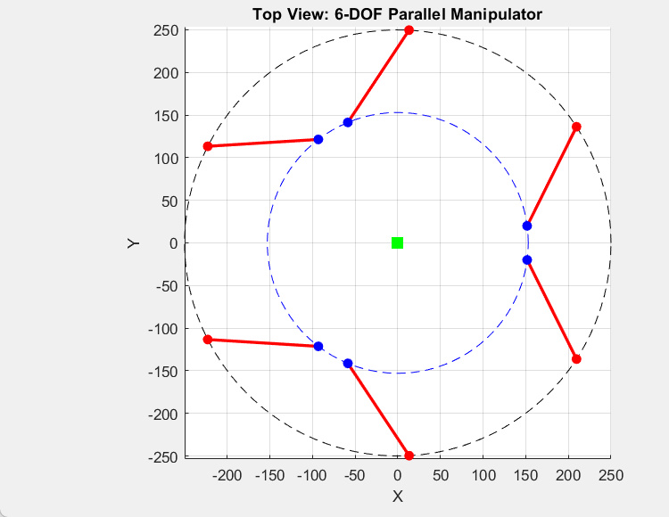
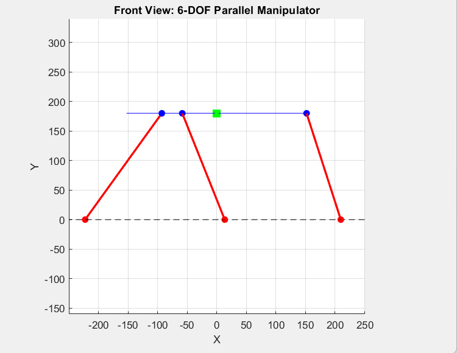

# Rotopod R-3000 – 6-DOF Parallel Manipulator

## 📌Project Overview
This project presents the **design, simulation, and analysis** of a **Rotopod R-3000** (Stewart Platform).  
The work combines **SolidWorks modeling**, **CoppeliaSim simulation**, and **MATLAB kinematic analysis** to study its motion and optimize the design.

---

## 🎯Objectives
- Design and model the Rotopod mechanism inspired by the Stewart Platform.  
- Simulate kinematics in **CoppeliaSim**.  
- Derive and implement **inverse kinematics equations** in **MATLAB**.  
- Validate simulation results with analytical models.  
- Optimize design for **efficiency, adaptability, and cost**.

---

## 🛠Tools & Software
- **SolidWorks** – CAD design of Rotopod R-3000.  
- **CoppeliaSim Pro** – Motion simulation and data extraction.  
- **MATLAB** – Kinematic equations, symbolic solving, and visualization.  
- **Symbolic Math Toolbox** – Nonlinear solver for inverse kinematics.  

---

## 📐Methodology
1. **CAD Modeling** in SolidWorks.  
2. **Simulation** of motion and joints in CoppeliaSim.  
3. **Kinematic Analysis** using inverse kinematics equations.  
4. **MATLAB Implementation** for solving and visualizing motion.  

---

## 📊Results
- Successfully modeled the **Rotopod R-3000** in SolidWorks.  
- Verified motion behavior in CoppeliaSim.  
- Implemented a MATLAB solver for joint angles.  
- Visualized manipulator from **top** and **front views**.  

## 📂 Repository Structure
├── solidworks_model/ # CAD files

├── simulation/ # CoppeliaSim project files

├── matlab/

│ ├── inverse_kinematics.m # Kinematic solver

│ ├── plot_robot.m # Visualization function

│ └── main.m # Main MATLAB script

└── README.md # This file


---

## 📖 MATLAB Code Example
Below is the **MATLAB script** used for inverse kinematics and visualization:

```matlab
clc;
clear;
close all;

%-------------------------------------------------------------------------%

Pp = [30, 0, 140];  
Rp = eye(3); 

q = inverse_kinematics(Pp, Rp);
disp('Joint angles (in radians):');
disp(q);
disp('Joint angles (in degrees):');
disp(q * 180 / pi);

figure;
set(gcf, 'Position', [100, 100, 1200, 500]); 

subplot(1, 2, 1);
plot_robot(Pp, Rp, q, 'top');

subplot(1, 2, 2);
plot_robot(Pp, Rp, q, 'front');

sgtitle('6-DOF Parallel Manipulator');
```
---
## 📸 Simulation Results

### Top View


### Front View


---
## 👨‍🎓 Authors

- **Mohammad Mahdi Khademi**
- **Negar Naghavian**

Supervised by: Dr. Seyed Hassan Zabihi

---
## 🔬 Applications

Vibration isolation platforms

Robotics and automation

Flight simulators and motion control

Medical robotics (rehabilitation, surgery assistance)

---
